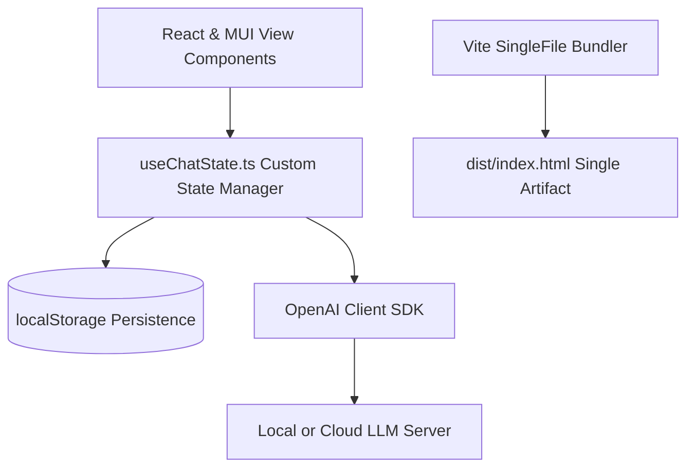

# Standalone LLM Chat Client

A lightweight, production-grade, single-page LLM chat application built with React, TypeScript, and Material UI (MUI). The application compiles into a **single standalone HTML file** (`dist/index.html`), allowing it to be run completely offline, served from local filesystems via `file://` URLs, or hosted on static pages without requiring a backend server.

---

## Key Features

1. **Standalone Distribution:** Inlines all JavaScript, CSS, and asset resources into a single HTML file using `vite-plugin-singlefile`.
2. **API Clients & SSE Streaming:** Connects to any OpenAI-compatible local or cloud model server (e.g., Ollama, LM Studio, OpenAI, Gemini, OpenRouter) and handles real-time Server-Sent Events (SSE) stream decoding.
3. **Generation Controls:**
    *   **Stop Call:** Instantly aborts ongoing LLM generation streams.
    *   **Prefill Continuation:** Appends text starting from any prior assistant message.
    *   **Regenerate:** Instantly clears and replays assistant responses.
4. **Multimodal Attachments:**
    *   **Image & File Staging:** Attach files (auto-injected as code blocks) and images (base64 data URLs) with staging preview chips.
    *   **Clipboard Paste:** Support pasting images directly from the clipboard.
    *   **Client-Side Downsizing:** Configurable max px downsizing setting to optimize base64 size before API calls.
5. **Layout & UI Polish:**
    *   **Three-Panel Design:** Left sidebar (search, chat history, settings toggles), middle workspace (chat history and input area), and right sidebar (parameters, API log panel).
    *   **Identical Sizing on Edit:** Toggling message edit mode retains the exact box width, height, padding, and text wrapping alignment, preventing visual layout shift.
6. **Comprehensive API Logs:** Tracks every endpoint call in full detail (payloads, system prompts, durations, token counts, and token generation speeds).
7. **Offline-First Persistence:** Automatically persists configs, settings, active chats, and logs to the browser's `localStorage`.

---

## Architectural Layout



*   **State Management:** Governed centrally by `src/hooks/useChatState.ts`.
*   **Services:** Sizing, client-side canvas downsizing (`src/services/image.ts`), and log sanitization (`src/services/openai.ts`).
*   **Bundler:** Leverages Vite coupled with `vite-plugin-singlefile` to inline dependencies (including icons and font configurations) into the compiled index.

---

## Developer Setup

### Prerequisites
*   [Node.js](https://nodejs.org/) (v18.0.0 or higher recommended)
*   npm (v9.0.0 or higher)

### Installation
Clone the repository and install dependencies:
```bash
npm install
```

### Local Development
Run the local development server (with hot-module replacement):
```bash
npm run dev
```
Open [http://localhost:5173](http://localhost:5173) in your browser.

### Production Compilation
Build the production single-file bundle:
```bash
npm run build
```
The resulting single-file asset will be output to `dist/index.html`. You can double-click this file to run the entire application directly in your browser.

### Deployment (GitHub Pages)
The repository is configured with a GitHub Actions workflow at `.github/workflows/deploy.yml` to automatically build and host the application on GitHub Pages when you push to the `main` branch.

To configure this in your GitHub repository:
1. Push this repository to GitHub.
2. Navigate to **Settings** > **Pages** in the repository.
3. Under **Build and deployment** > **Source**, change the selection from **Deploy from a branch** to **GitHub Actions**.
4. The workflow will trigger on the next push and deploy your single-page app.

---

## Test Suite

The project includes an end-to-end integration test suite driven by [Playwright](https://playwright.dev/). All tests are fully mocked to run independent of actual network endpoints, ensuring fast and robust local execution.

### Execution
Run the complete test suite:
```bash
npm run test
```

### Mocking Strategy
The integration tests mock the `/v1/chat/completions` endpoint:
*   **SSE Streaming Mocks:** Intercepts endpoints and sends back simulated stream event chunks (SSE format) to verify token rendering and live metric calculations.
*   **Stalled Connection Mocking:** Uses unresolved promises to simulate hung LLM calls, validating that the Stop button successfully aborts the request.
*   **Wrapping Validation:** Measures and asserts the exact dimensions (width and height) of the message bubble before and after triggering inline edit mode, guaranteeing zero layout shift.
